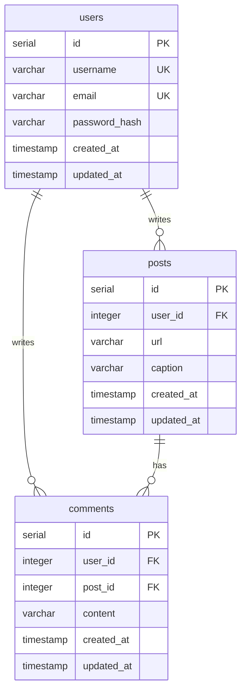

# SQL Practice

## Database Schema

Three tables — users, posts, and comments — where a user writes many posts and many comments, and a post has many comments.

```mermaid
erDiagram
    users ||--o{ posts : "writes"
    users ||--o{ comments : "writes"
    posts ||--o{ comments : "has"
    users {
        serial id PK
        varchar username UK
        varchar email UK
        varchar password_hash
        timestamp created_at
        timestamp updated_at
    }
    posts {
        serial id PK
        integer user_id FK
        varchar url
        varchar caption
        timestamp created_at
        timestamp updated_at
    }
    comments {
        serial id PK
        integer user_id FK
        integer post_id FK
        varchar content
        timestamp created_at
        timestamp updated_at
    }
```
